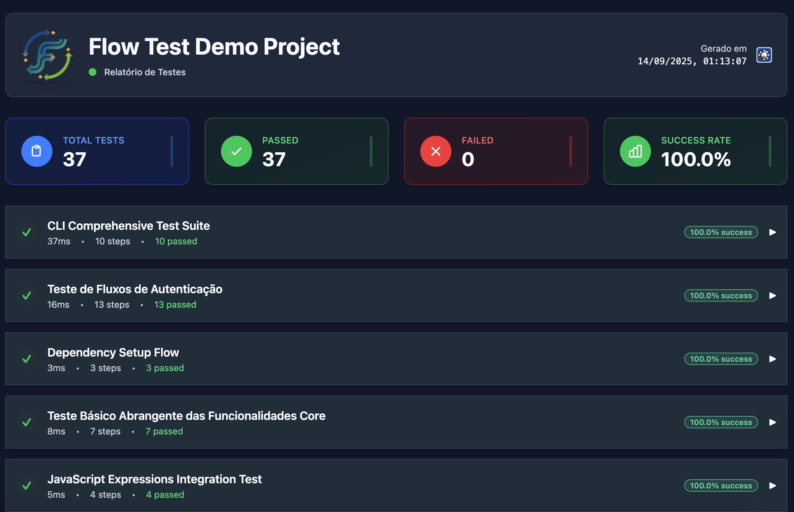
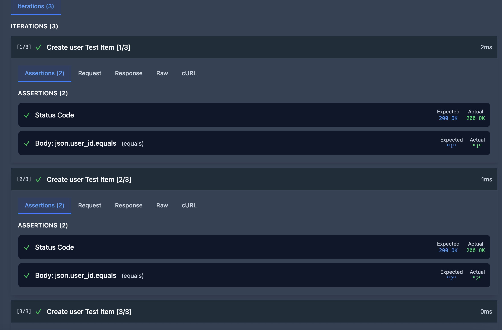
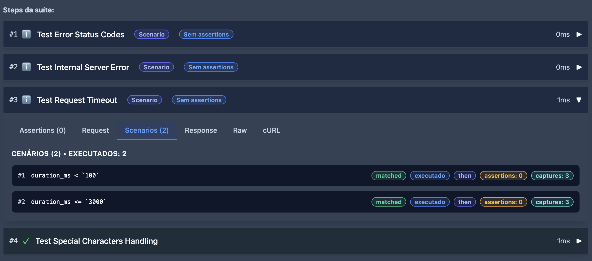
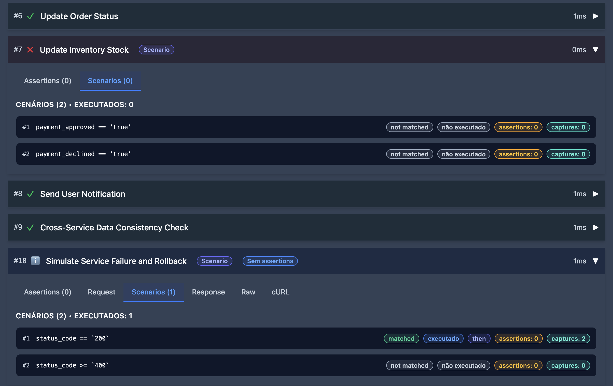

# Flow Test Engine

A TypeScript-based API testing engine for writing rich, declarative flows in YAML. It supports request chaining, variable interpolation, flexible assertions, conditional scenarios, and clean reports in JSON and HTML.



## Key Features

- Request chaining and cross-step data capture
- Variable interpolation with environment overrides and Faker.js
- Iteration patterns (arrays and ranges)
- Powerful assertions and conditional scenarios
- Reporting to JSON and HTML (plus console summary)
- Directory-based discovery and filtering (tags, priorities, suites)

## Quick Start

### Install

```bash
git clone https://github.com/marcuspmd/flow-test.git
cd flow-test
npm install
```

### Run

```bash
# Run via Docker Compose (default npm test)
npm test

# Run a specific test suite (ts-node)
npm run dev tests/start-flow.yaml

# Use the flow-test command directly (after npm install -g or npx)
npm run test:flow
npx flow-test -c flow-test.config.yml

# Verbose or silent presets
npm run test:verbose
npm run test:silent

# Priority filters via helper scripts
npm run test:critical   # only critical
npm run test:high       # critical + high

# Direct Compose command (equivalent)
docker compose up --build --abort-on-container-exit --exit-code-from flow-test flow-test
# Results available in ./results (on host)
```

### CLI (direct usage)

During development, prefer `npm run dev`. After building, you can run the compiled CLI:

```bash
npm run build
node dist/cli.js --dry-run
node dist/cli.js --directory tests --verbose
node dist/cli.js --tag smoke,regression
```

## Directory Structure & Discovery

The engine discovers `**/*.yaml` recursively (excluding `node_modules`, `dist`, `results`, and others configured in `flow-test.config.yml`). Organize tests by domain or feature as you prefer.

Benefits:
- Automatic discovery of nested `tests/**.yaml`
- Run by directory, tag, suite, node ID, or priority
- Scales well as your test matrix grows

## Swagger/OpenAPI Import

Generate suites from an OpenAPI/Swagger spec.

```bash
# Import OpenAPI 3.0 or Swagger 2.0
node dist/cli.js --swagger-import tests/__swagger_example.json

# Custom output directory
node dist/cli.js --swagger-import api.yaml --swagger-output ./tests/imported-api

# Import and run
node dist/cli.js --swagger-import api.json && node dist/cli.js --directory ./tests/imported-api --verbose
```

## Postman Collection Import/Export

Convert between Flow Test suites and Postman collections directly from the CLI.

```bash
# Export an existing suite to Postman format
node dist/cli.js --postman-export tests/auth-flows-test.yaml --postman-output ./exports/auth-flows.postman_collection.json

# Import a Postman collection and generate Flow Test YAML
node dist/cli.js --postman-import ./postman/create-proposal.postman_collection.json --postman-import-output ./tests/imported-postman
```

To perform the end-to-end import → run → cleanup in one command, use:

```bash
npm test
```

## Reports

- JSON artifacts in `results/` (latest at `results/latest.json`)
- HTML report viewer via:

```bash
npm run report:html
```

Example visuals:






## Example Suites

Run any file in `tests/` directly:

```bash
npm run dev tests/faker-demo.yaml
```

Handy examples:
- `tests/start-flow.yaml` – Basic HTTP flow demo
- `tests/auth-flows-test.yaml` – Auth patterns (JWT, refresh)
- `tests/environment-variables-test.yaml` – Env variables
- `tests/variable-interpolation-test.yaml` – Interpolation and capture
- `tests/performance-test.yaml` – Performance checks

## Configuration

The engine reads `flow-test.config.yml` by default (override with `--config`). The schema includes:

```yaml
# flow-test.config.yml
project_name: "Flow Test Demo Project"
test_directory: "./tests"

globals:
  variables:
    httpbin_url: "http://localhost:8080"
  timeouts:
    default: 30000
    slow_tests: 60000

discovery:
  patterns: ["**/*.yaml"]
  exclude: ["**/node_modules/**", "**/dist/**", "**/results/**", "**/temp/**"]

priorities:
  levels: [critical, high, medium, low]
  required: [critical, high]
  fail_fast_on_required: false

execution:
  mode: sequential           # or parallel
  max_parallel: 3
  timeout: 60000
  continue_on_failure: true
  retry_failed:
    enabled: true
    max_attempts: 2
    delay_ms: 2000

reporting:
  formats: [html, json]
  output_dir: "./results"
  aggregate: true
  include_performance_metrics: true
  include_variables_state: true
```

Environment variables prefixed with `FLOW_TEST_` override globals (e.g., `FLOW_TEST_HTTPBIN_URL`).

### YAML Suite Basics

```yaml
# Example from tests/start-flow.yaml
suite_name: "Basic HTTP Test Flow"
base_url: "{{httpbin_url}}"  # Uses httpbin.org for demo

variables:
  user_id: 123
  user_name: "alpha_user"

steps:
  - name: "Send POST data and capture response"
    request:
      method: POST
      url: "/post"
      headers:
        Content-Type: "application/json"
        X-Custom-Header: "Flow-Test-Demo"
      body:
        user_id: "{{user_id}}"
        username: "{{user_name}}"
        timestamp: "{{$now}}"

    assert:
      status_code: 200
      body:
        json.user_id:
          equals: "{{user_id}}"
        json.username:
          equals: "{{user_name}}"

    capture:
      captured_username: "body.json.username"
      server_data: "body.json"
```

### Advanced Features

#### Request Chaining
```yaml
# Example from tests/auth-flows-test.yaml
steps:
  - name: "Simulate Login"
    request:
      method: POST
      url: "/post"  # httpbin.org endpoint
      body:
        username: "{{test_credentials.username}}"
        password: "{{test_credentials.password}}"
    capture:
      auth_token: "body.json.token"  # Simulate capturing JWT from response
      user_id: "body.json.user_id"

  - name: "Get User Data with Token"
    request:
      method: GET
      url: "/get?user_id={{user_id}}"
      headers:
        Authorization: "Bearer {{auth_token}}"
        X-User-ID: "{{user_id}}"
```

#### Conditional Scenarios
```yaml
steps:
  - name: "API Call with Multiple Outcomes"
    request:
      method: GET
      url: "/data"

    scenarios:
      - condition: "status_code == `200`"
        then:
          capture:
            data: "body.results"

      - condition: "status_code == `404`"
        then:
          capture:
            error: "body.message"
```

#### Assertions
```yaml
assert:
  status_code: 200
  headers:
    content-type:
      contains: "application/json"
  body:
    users:
      length:
        greater_than: 0
    status:
      equals: "success"
  response_time_ms:
    less_than: 1000
```

#### JavaScript Expressions
```yaml
# Example from tests/javascript-expressions-test.yaml
steps:
  - name: "Dynamic calculations with JavaScript"
    request:
      method: POST
      url: "/post"
      body:
        # Mathematical calculations
        calculated_value: "{{$js.result = base_number * multiplier; return result}}"
        # Current timestamp
        timestamp: "{{$js.return Date.now()}}"
        # Random number generation
        random_id: "{{$js.return Math.floor(Math.random() * 1000) + 1}}"
        # String manipulation
        uppercase_name: "{{$js.return 'flow-test'.toUpperCase()}}"
        # Date formatting
        formatted_date: "{{$js.return new Date().toISOString().split('T')[0]}}"
```

#### Iteration Patterns
```yaml
# Example from tests/iteration-examples.yaml
steps:
  # Array iteration - eliminates repetitive test steps
  - name: "Create user {{item.name}}"
    iterate:
      over: "{{test_users}}"
      as: "item"
    request:
      method: POST
      url: "/post"
      headers:
        Content-Type: "application/json"
      body:
        user_id: "{{item.id}}"
        name: "{{item.name}}"
        email: "{{item.email}}"
        role: "{{item.role}}"
    assert:
      status_code: 200
      body:
        json.user_id:
          equals: "{{item.id}}"

  # Range iteration - for load testing or repeated operations
  - name: "Load test iteration {{index}}"
    iterate:
      range: "1..5"
      as: "index"
    request:
      method: GET
      url: "/get"
      headers:
        X-Iteration: "{{index}}"
        X-Test-Batch: "range-iteration"
      params:
        iteration: "{{index}}"
    assert:
      status_code: 200
      body:
        args.iteration:
          equals: "{{index}}"
```

#### Faker.js Integration
```yaml
# Example from tests/faker-demo.yaml
steps:
  - name: "Generate fake user data"
    request:
      method: POST
      url: "/post"
      body:
        # Faker person data (no $ prefix)
        firstName: "{{faker.person.firstName}}"
        lastName: "{{faker.person.lastName}}"
        fullName: "{{faker.person.fullName}}"
        email: "{{faker.internet.email}}"
        phone: "{{faker.phone.number}}"

        # Faker location data
        city: "{{faker.location.city}}"
        streetAddress: "{{faker.location.streetAddress}}"

        # Faker text data
        description: "{{faker.lorem.sentence}}"
```

#### Environment Variables
```yaml
# Example from tests/environment-variables-test.yaml
steps:
  - name: "Use system environment variables"
    request:
      method: POST
      url: "/post"
      headers:
        X-User: "{{$env.USER}}"
        X-Home: "{{$env.HOME}}"
      body:
        current_user: "{{$env.USER}}"
        custom_setting: "{{$env.FLOW_TEST_CUSTOM}}"
```

#### Global Variable Registry
```yaml
# Export variables to be used across different test suites
# In tests/auth-flows-test.yaml:
exports:
  - auth_token
  - user_id
  - auth_status

# In another test suite, access the exported variables:
headers:
  Authorization: "Bearer {{auth_flows_test.auth_token}}"
  X-User-ID: "{{auth_flows_test.user_id}}"
```

## Using Flow Test in Your Project

### Installation

Add flow-test as a dev dependency to your project:

```bash
npm install --save-dev flow-test-engine
```

### Configuration

Create a `flow-test.config.yml` file in your project root:

```yaml
project_name: "My API Tests"
test_directory: "./tests"

# Add your test configuration here
```

### Package.json Script

Add the test script to your `package.json`:

```json
{
  "scripts": {
    "test:flow": "flow-test -c flow-test.config.yml"
  }
}
```

### Usage

Run your tests with:

```bash
# Using npm script (recommended)
npm run test:flow

# Or directly with npx (when installed globally or as dependency)
npx flow-test -c flow-test.config.yml

# With additional options
npm run test:flow -- --verbose
npx flow-test -c flow-test.config.yml --tag smoke
```

**Note:** When using `npm run test:flow` within this project, it uses the local compiled binary. When using flow-test in other projects, install it as a dependency first.

This provides a consistent way to run your API tests across different environments and CI/CD pipelines.

### Example Project Setup

For using flow-test in **other projects** (not this repository):

```bash
# 1. Install flow-test as dev dependency
npm install --save-dev flow-test-engine

# 2. Create test directory and config
mkdir tests
touch flow-test.config.yml

# 3. Add to package.json scripts
# (add "test:flow": "flow-test -c flow-test.config.yml" to scripts)

# 4. Create a simple test
cat > tests/my-api-test.yaml << 'EOF'
suite_name: "My API Test"
base_url: "https://jsonplaceholder.typicode.com"

steps:
  - name: "Get users"
    request:
      method: "GET"
      url: "/users"
    assert:
      status_code: 200
      body:
        length:
          greater_than: 0
EOF

# 5. Run the test
npm run test:flow
```

For using within **this repository** (development), the `test:flow` script uses the local compiled binary.

```bash
flow-test [options]

Configuration:
  -c, --config <file>       Configuration file path
  -d, --directory <dir>     Test directory override (supports subdirectories)
  -e, --environment <env>   Environment name for variable resolution

Import/Export:
  --swagger-import <file>   Import OpenAPI/Swagger spec and generate test files
  --swagger-output <dir>    Output directory for imported Swagger tests (default: ./tests/imported)
  --postman-export <path>   Export Flow Test suite(s) to a Postman collection JSON
  --postman-output <path>   Output file or directory for Postman export (defaults alongside input)
  --postman-import <file>   Import a Postman collection and generate Flow Test suite(s)
  --postman-import-output <dir> Output directory for generated suites (default alongside collection)

Verbosity:
  --verbose                 Show detailed output including request/response data
  --detailed                Show detailed progress without full request/response
  --simple                  Show basic progress (default)
  --silent                  Silent execution, errors only

Filtering:
  --priority <levels>       Run only tests with specified priorities
                           Example: --priority critical,high
  --suite <names>          Run only specified test suites
  --tag <tags>             Run only tests with specified tags
                           Example: --tag user-onboarding,checkout-process
  --node <ids>             Run only specified test nodes

Execution:
  --dry-run                Show execution plan without running tests
  --no-log                 Disable automatic log file generation

Other:
  -h, --help               Show help message
  -v, --version            Show version information
```

Verbosity:
  --verbose                 Show detailed output including request/response data
  --detailed                Show detailed progress without full request/response
  --simple                  Show basic progress (default)
  --silent                  Silent execution, errors only

Filtering:
  --priority <levels>       Run only tests with specified priorities
                           Example: --priority critical,high
  --suite <names>          Run only specified test suites
  --tag <tags>             Run only tests with specified tags
  --node <ids>             Run only specified test nodes

Execution:
  --dry-run                Show execution plan without running tests
  --no-log                 Disable automatic log file generation

Other:
  -h, --help               Show help message
  -v, --version            Show version information
```

## Project Structure

```
flow-test/
├── src/                           # TypeScript source code
│   ├── cli.ts                    # CLI entry point
│   ├── index.ts                  # Public exports
│   ├── core/                     # Pure engine logic
│   │   ├── engine.ts             # Main execution engine
│   │   ├── config.ts             # Configuration management
│   │   └── discovery.ts          # Recursive test discovery (**/*.yaml)
│   ├── services/                 # Services and orchestration
│   │   ├── http.service.ts
│   │   ├── assertion.service.ts
│   │   ├── capture.service.ts
│   │   ├── variable.service.ts
│   │   ├── swagger-import.service.ts
│   │   ├── reporting.ts
│   │   └── (logger|priority|execution|scenario|iteration|javascript).service.ts
│   ├── report-generator/         # HTML report generator (CLI + components)
│   │   ├── cli.ts
│   │   ├── html-generator.ts
│   │   ├── modular-html-generator.ts
│   │   └── components/
│   │       ├── header.component.ts
│   │       ├── summary-cards.component.ts
│   │       └── test-(suite|step).component.ts
│   ├── templates/                # Report CSS templates
│   │   ├── report.css
│   │   └── styles.css            # Built via tailwind CLI
│   └── types/                    # Type definitions (PascalCase)
│       ├── engine.types.ts
│       ├── config.types.ts
│       └── swagger.types.ts
├── tests/                        # YAML test suites
│   ├── start-flow.yaml
│   ├── auth-flows-test.yaml
│   └── *.yaml
├── results/                      # Execution artifacts (latest.json)
├── docs/                         # Documentation and guides
├── public/                       # Static assets for README/docs
├── dist/                         # Compiled output from `npm run build`
├── flow-test.config.yml          # Default engine config (override with --config)
└── package.json
```

## Development

```bash
npm run build     # Compile TypeScript
npm test          # Import Swagger example → run all → cleanup
```

## Contributing

1. Fork the repository
2. Create a feature branch
3. Make your changes and add/adjust tests
4. Open a pull request with a short rationale and, if possible, a report screenshot

## License

MIT – see `package.json` for details.

## More Docs

- [Documentation Index](docs/INDEX.md) – All docs organized by topic
- [YAML Examples](docs/YAML_EXAMPLES.md) – Comprehensive patterns
- [API Documentation](docs/API_DOCUMENTATION.md) – API reference
- [Best Practices](docs/BEST_PRACTICES.md) – Recommendations
- [Troubleshooting](docs/TROUBLESHOOTING.md) – Common issues and fixes
- [Configuration](docs/CONFIGURATION.md) – Full config schema and samples
- [Codex Cloud Integration](docs/integrations/CODEX_CLOUD.md) – CI + optional cloud publish
