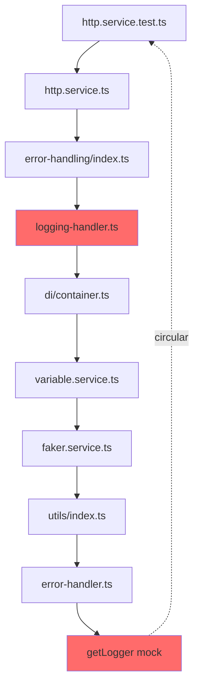

# Análise: Integração do Error Handling Chain com DI Container

**Data:** 2025-01-27
**Contexto:** Task 01 - Error Handling Chain (Phase 2)
**Status:** ⚠️ Bloqueio identificado - Circular Dependency em testes

---

## 📊 Resumo Executivo

### Trabalho Realizado (Phase 1)
✅ **Infraestrutura completa implementada:**
- Error Handling Chain com Chain of Responsibility pattern
- 4 handlers concretos (Logging, Retry, Notification, Base)
- Builder com factory methods
- 30 testes, 94.93% coverage
- Commit realizado

### Bloqueio (Phase 2)
❌ **Tentativa de integração do HttpService falhou:**
- Circular dependency durante inicialização de testes
- LoggingErrorHandler → DI Container → VariableService → Utils → ErrorHandler → getLogger()
- Mock de logger não inicializa antes da importação dos módulos

---

## 🔍 Análise Técnica

### 1. Problema Identificado

**Stack trace do erro:**
```
ReferenceError: Cannot access 'mockLogger' before initialization
  at getLogger (src/services/__tests__/http.service.test.ts:19:20)
  at Object.<anonymous> (src/utils/error-handler.ts:100:43)
  at Object.require (src/utils/index.ts:17:1)
  at Object.require (src/services/faker.service.ts:18:1)
  at Object.require (src/services/variable.service.ts:16:1)
  at Object.require (src/di/container.ts:51:1)
  at Object.require (src/utils/error-handling/handlers/logging-handler.ts:6:1)
  at Object.require (src/utils/error-handling/index.ts:11:1)
  at Object.require (src/services/http.service.ts:21:1)
```

**Root cause:**
O LoggingErrorHandler executa `container.get<ILogger>(TYPES.ILogger)` durante a importação do módulo, antes que os mocks do Jest estejam prontos.

### 2. Cadeia de Dependências



### 3. Tentativa de Solução (Lazy Loading)

**O que foi tentado:**
```typescript
// HttpService - tentativa de lazy loading
private _errorHandler?: ErrorHandlerChain;

private get errorHandler(): ErrorHandlerChain {
  if (!this._errorHandler) {
    this._errorHandler = ErrorHandlerChain.createWithRetry();
  }
  return this._errorHandler;
}
```

**Por que não funcionou:**
O problema não é a instância da classe, mas o **import statement** que executa código de módulo no top-level:

```typescript
// src/utils/error-handling/handlers/logging-handler.ts
import { container } from '../../../di/container'; // ❌ Importa imediatamente

export class LoggingErrorHandler extends BaseErrorHandler {
  private logger = container.get<ILogger>(TYPES.ILogger); // ❌ Executa no top-level
}
```

---

## 🎯 Soluções Propostas

### Opção 1: Logger Injetado via Construtor (RECOMENDADO)

**Implementação:**
```typescript
// logging-handler.ts
export class LoggingErrorHandler extends BaseErrorHandler {
  constructor(private logger: ILogger) {
    super();
  }

  async handle(error: Error, context: ErrorContext): Promise<ErrorHandlingResult> {
    this.logger.error(...); // Usa logger injetado
    return this.passToNext(error, context);
  }
}

// error-handler-chain.ts
export class ErrorHandlerChain {
  static createWithRetry(logger?: ILogger): ErrorHandler {
    const loggerInstance = logger || container.get<ILogger>(TYPES.ILogger);
    const loggingHandler = new LoggingErrorHandler(loggerInstance);
    const retryHandler = new RetryErrorHandler();
    loggingHandler.setNext(retryHandler);
    return loggingHandler;
  }
}

// http.service.ts
export class HttpService {
  private get errorHandler(): ErrorHandlerChain {
    if (!this._errorHandler) {
      this._errorHandler = ErrorHandlerChain.createWithRetry(this.logger);
    }
    return this._errorHandler;
  }
}
```

**Vantagens:**
- ✅ Elimina circular dependency
- ✅ Facilita testes (mock direto no construtor)
- ✅ Inversão de controle mantida
- ✅ Não quebra padrão DI do projeto

**Desvantagens:**
- ⚠️ Precisa refatorar LoggingErrorHandler e NotificationErrorHandler
- ⚠️ Precisa ajustar factory methods

---

### Opção 2: Mock do Container Completo

**Implementação:**
```typescript
// http.service.test.ts
jest.mock('../../../di/container', () => ({
  container: {
    get: jest.fn((type) => {
      if (type === TYPES.ILogger) return mockLogger;
      if (type === TYPES.ICertificateService) return mockCertificateService;
      // ...
    })
  }
}));
```

**Vantagens:**
- ✅ Não precisa refatorar handlers
- ✅ Solução rápida

**Desvantagens:**
- ❌ Não escala bem (precisa mockar TUDO)
- ❌ Testes ficam frágeis
- ❌ Não resolve problema arquitetural

---

### Opção 3: jest.isolateModules()

**Implementação:**
```typescript
describe('HttpService', () => {
  let httpService: HttpService;

  beforeEach(() => {
    jest.isolateModules(() => {
      // Mock setup
      jest.mock('../../utils/error-handling/handlers/logging-handler', () => ({
        LoggingErrorHandler: MockLoggingErrorHandler
      }));

      // Import apenas dentro do isolateModules
      const { HttpService } = require('../http.service');
      httpService = new HttpService(...);
    });
  });
});
```

**Vantagens:**
- ✅ Controle total sobre ordem de importação
- ✅ Isolamento real entre testes

**Desvantagens:**
- ❌ Sintaxe complexa
- ❌ Não resolve problema arquitetural de fundo
- ❌ Testes ficam verbosos

---

### Opção 4: Lazy Loading no Handler

**Implementação:**
```typescript
export class LoggingErrorHandler extends BaseErrorHandler {
  private _logger?: ILogger;

  private get logger(): ILogger {
    if (!this._logger) {
      this._logger = container.get<ILogger>(TYPES.ILogger);
    }
    return this._logger;
  }

  async handle(error: Error, context: ErrorContext): Promise<ErrorHandlingResult> {
    this.logger.error(...); // Só agora pega do container
    return this.passToNext(error, context);
  }
}
```

**Vantagens:**
- ✅ Mudança mínima no código
- ✅ Resolve problema de timing

**Desvantagens:**
- ⚠️ Ainda depende do container
- ⚠️ Menos testável que injeção via construtor

---

## 📋 Recomendação Final

### 🥇 Escolha: **Opção 1 (Injeção via Construtor)**

**Justificativa:**
1. **Segue princípios SOLID:** Inversão de controle explícita
2. **Testabilidade:** Mocks simples e diretos
3. **Escalabilidade:** Padrão se aplica a outros serviços
4. **Manutenibilidade:** Dependências explícitas

**Impacto estimado:**
- ⏱️ **Tempo:** 1-2 horas
- 📂 **Arquivos afetados:** 4
  - `logging-handler.ts` (adicionar construtor)
  - `notification-handler.ts` (adicionar construtor)
  - `error-handler-chain.ts` (ajustar factory methods)
  - `error-handling.test.ts` (ajustar testes)

---

## 🚀 Próximos Passos

### Implementação da Solução

**Phase 2.1 - Refatorar Handlers:**
- [ ] LoggingErrorHandler: adicionar construtor com `logger: ILogger`
- [ ] NotificationErrorHandler: adicionar construtor com `logger: ILogger`
- [ ] Ajustar testes unitários dos handlers

**Phase 2.2 - Ajustar Factory Methods:**
- [ ] `ErrorHandlerChain.createDefault(logger?)` - aceita logger opcional
- [ ] `ErrorHandlerChain.createWithRetry(logger?)` - aceita logger opcional
- [ ] Ajustar testes de integração

**Phase 2.3 - Migrar HttpService:**
- [ ] Usar `ErrorHandlerChain.createWithRetry(this.logger)`
- [ ] Verificar que testes passam
- [ ] Medir coverage

**Phase 2.4 - Migrar Outros Serviços:**
- [ ] CaptureService
- [ ] CallService
- [ ] JavaScriptService
- [ ] ScenarioService

---

## 📊 Checklist de Validação

### Antes de Prosseguir
- [x] Infraestrutura Phase 1 completa
- [x] Testes Phase 1 passando (30/30)
- [x] Coverage Phase 1 ≥ 90% (94.93%)
- [ ] Solução DI escolhida e documentada

### Após Refatoração
- [ ] Handlers refatorados com construtor
- [ ] Factory methods ajustados
- [ ] Testes unitários atualizados
- [ ] HttpService migrado
- [ ] Testes HttpService passando
- [ ] Coverage ≥ baseline

---

## 📚 Referências

### Padrões Aplicados
- **Chain of Responsibility:** Gang of Four, Design Patterns
- **Dependency Injection:** Martin Fowler, Inversion of Control Containers
- **Builder Pattern:** Joshua Bloch, Effective Java

### Código Relacionado
- `src/di/container.ts` - InversifyJS container setup
- `src/di/identifiers.ts` - Type identifiers (TYPES)
- `src/services/logger.service.ts` - Interface ILogger

### Documentação do Projeto
- `tasks/architecture-improvements/01-error-handling-chain.md`
- `tasks/architecture-improvements/implementation-checklist.md`

---

**Autor:** AI Agent (GitHub Copilot)
**Revisão:** Pendente
**Status:** 📖 Análise completa - Aguardando decisão de implementação
