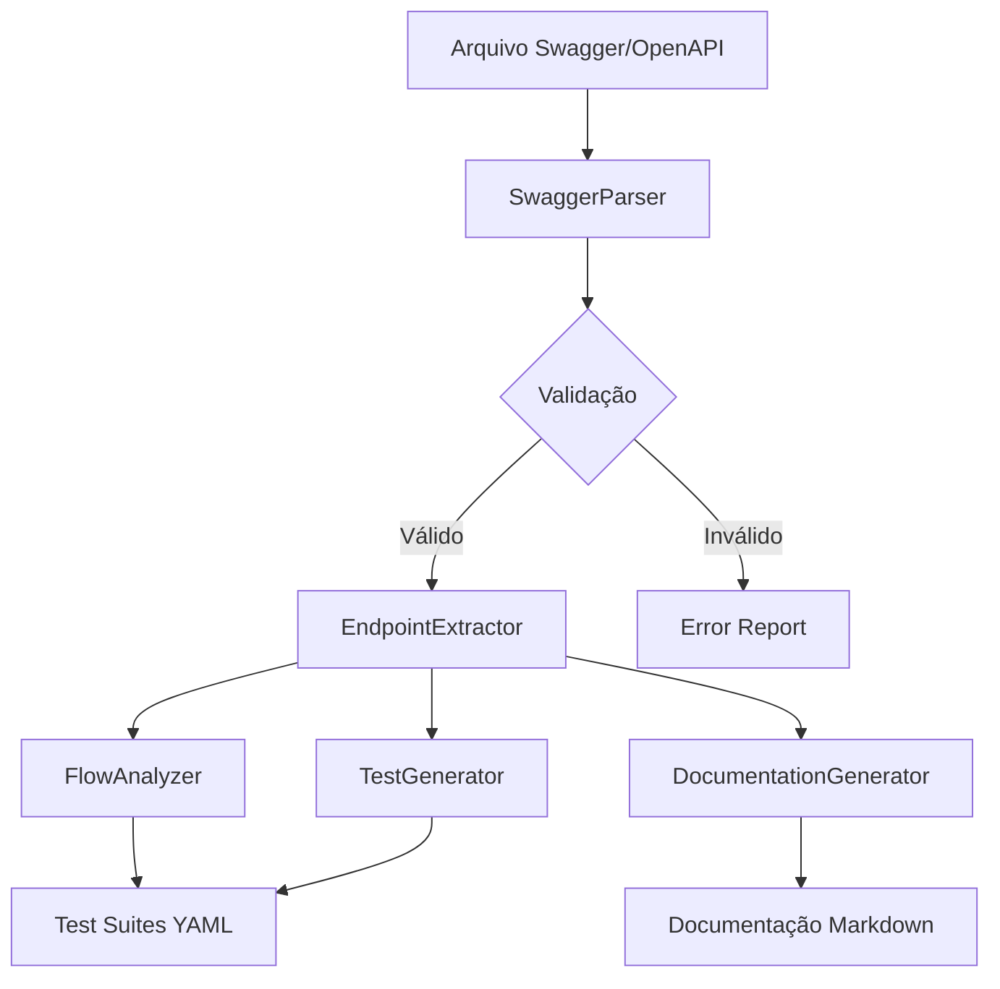

# Arquitetura do Sistema de Importação Swagger/OpenAPI

## Visão Geral

Este documento descreve a arquitetura proposta para o sistema de importação Swagger/OpenAPI no flow-test v2.0, incluindo decisões técnicas, estrutura de código e integração com o sistema existente.

## Contexto do Projeto

O flow-test v2.0 é um motor de testes de API baseado em TypeScript que executa suítes de teste definidas em YAML. A arquitetura atual inclui:

- **FlowTestEngine**: Classe principal orquestradora
- **Serviços modulares**: ExecutionService, ReportingService, ConfigManager, etc.
- **Sistema de tipos**: engine.types.ts, config.types.ts
- **CLI**: Interface de linha de comando em cli.ts
- **Formato YAML**: Estrutura específica com node_id, suite_name, steps, etc.

## Arquitetura Proposta

### 1. Estrutura de Módulos

```
src/core/swagger/
├── parser/
│   ├── swagger-parser.ts          # Parser principal
│   ├── json-parser.ts             # Parser específico JSON
│   ├── yaml-parser.ts             # Parser específico YAML
│   └── validator.ts               # Validador de especificações
├── generators/
│   ├── endpoint-generator.ts      # Gerador de endpoints
│   ├── test-generator.ts          # Gerador de testes YAML
│   └── documentation-generator.ts # Gerador de documentação
├── analyzers/
│   ├── flow-analyzer.ts           # Analisador de flows
│   └── dependency-analyzer.ts     # Analisador de dependências
├── types/
│   ├── openapi.types.ts           # Tipos OpenAPI
│   └── swagger.types.ts           # Tipos específicos do sistema
└── index.ts                       # Exportações principais
```

### 2. Integração com Sistema Existente

#### Extensão do FlowTestEngine

```typescript
class ExtendedFlowTestEngine extends FlowTestEngine {
  private swaggerImporter: SwaggerImporter;

  constructor(configPath?: string) {
    super(configPath);
    this.swaggerImporter = new SwaggerImporter(this.configManager);
  }

  async importSwagger(filePath: string): Promise<ImportResult> {
    const spec = await this.swaggerImporter.parse(filePath);
    const testSuites = await this.swaggerImporter.generateTests(spec);

    // Integrar com TestDiscovery
    await this.testDiscovery.addGeneratedSuites(testSuites);

    return {
      success: true,
      generatedSuites: testSuites.length,
      outputPath: this.config.swagger.output_dir
    };
  }
}
```

#### Extensão do CLI

```typescript
// Em cli.ts - adicionar novos argumentos
case "--import-swagger":
  if (i + 1 < args.length) {
    const swaggerFile = args[++i];
    await engine.importSwagger(swaggerFile);
    return;
  }
  break;

case "--generate-tests":
  if (i + 1 < args.length) {
    const swaggerFile = args[++i];
    const outputDir = args[++i] || './tests/generated';
    await engine.generateTestsFromSwagger(swaggerFile, outputDir);
    return;
  }
  break;
```

### 3. Fluxo de Dados



### 4. Mapeamento de Conceitos

#### OpenAPI → Flow Test

| OpenAPI | Flow Test | Descrição |
|---------|-----------|-----------|
| `paths` | `steps[].request` | Endpoints da API |
| `parameters` | `variables` | Parâmetros de entrada |
| `responses` | `assert` | Validações de resposta |
| `securitySchemes` | `variables` | Configurações de auth |
| `tags` | `metadata.tags` | Categorização |

#### Exemplo de Mapeamento

**OpenAPI Path:**
```yaml
/users/{id}:
  get:
    summary: "Get user by ID"
    parameters:
      - name: id
        in: path
        required: true
        schema:
          type: integer
    responses:
      200:
        description: "User found"
        content:
          application/json:
            schema:
              type: object
              properties:
                id: { type: integer }
                name: { type: string }
```

**Flow Test Gerado:**
```yaml
- name: "Get user by ID"
  request:
    method: "GET"
    url: "/users/{{user_id}}"
  assert:
    status_code: 200
    body:
      id:
        type: "number"
        exists: true
      name:
        type: "string"
        exists: true
```

### 5. Estratégias de Geração

#### 5.1 Geração de Testes

1. **Testes Individuais**: Um teste por endpoint
2. **Testes de Fluxo**: Sequências lógicas de endpoints
3. **Testes de Cenário**: Casos de uso completos

#### 5.2 Detecção de Dependências

```typescript
interface FlowPattern {
  name: string;
  description: string;
  steps: EndpointData[];
  dependencies: string[]; // IDs de outros patterns
  variables: Record<string, any>;
}

// Exemplos de patterns detectados:
// - Auth Flow: login → get_token → use_token
// - CRUD: create → read → update → delete
// - Search: search → filter → paginate
```

#### 5.3 Geração de Dados Dinâmicos

```typescript
class TestDataGenerator {
  // Usar faker.js para dados realistas
  generateUserData(): UserData {
    return {
      name: faker.person.fullName(),
      email: faker.internet.email(),
      age: faker.number.int({ min: 18, max: 80 })
    };
  }

  // Gerar dados baseados em schema OpenAPI
  generateFromSchema(schema: OpenAPISchema): any {
    // Implementar geração baseada em tipo, formato, etc.
  }
}
```

### 6. Configuração

#### Arquivo de Configuração Estendido

```yaml
# flow-test.config.yml
swagger_import:
  enabled: true
  input_formats: ["json", "yaml", "yml"]
  output_dir: "./tests/generated"
  documentation_dir: "./docs/api"

  generation:
    generate_individual_tests: true
    generate_flow_tests: true
    generate_documentation: true
    include_examples: true

  auth:
    default_strategy: "bearer_token"
    strategies:
      bearer_token:
        header_name: "Authorization"
        prefix: "Bearer"
      api_key:
        header_name: "X-API-Key"
      basic_auth:
        header_name: "Authorization"

  validation:
    strict_mode: false
    allow_unknown_formats: true
    validate_responses: true

  templates:
    test_template: "./templates/test-suite.yml.hbs"
    documentation_template: "./templates/api-docs.md.hbs"
```

### 7. Tratamento de Erros

#### Estratégias de Recuperação

1. **Erros de Parsing**: Tentar formatos alternativos
2. **Schemas Inválidos**: Usar schemas genéricos
3. **Referências Circulares**: Detectar e quebrar ciclos
4. **Endpoints Sem Exemplos**: Gerar dados automaticamente

#### Logging Estruturado

```typescript
interface ImportLog {
  level: "info" | "warn" | "error";
  message: string;
  file?: string;
  line?: number;
  endpoint?: string;
  suggestion?: string;
}

// Exemplo de logs:
// INFO: Successfully parsed 25 endpoints from swagger.json
// WARN: Endpoint /users/{id} missing response examples, using generated data
// ERROR: Invalid OpenAPI version 4.0, expected 3.x
```

### 8. Extensibilidade

#### Plugins de Geração

```typescript
interface GeneratorPlugin {
  name: string;
  supports: string[]; // ["json", "yaml", "xml"]

  generate(spec: OpenAPISpec): Promise<GeneratedContent>;
  validate(content: GeneratedContent): Promise<ValidationResult>;
}

// Plugins disponíveis:
// - REST API Generator
// - GraphQL Generator
// - gRPC Generator
// - SOAP Generator
```

### 9. Métricas e Monitoramento

#### Métricas de Importação

```typescript
interface ImportMetrics {
  startTime: Date;
  endTime: Date;
  duration: number;
  filesProcessed: number;
  endpointsGenerated: number;
  testsGenerated: number;
  errors: number;
  warnings: number;
}

// Integração com ReportingService existente
class SwaggerImportReporter extends ReportingService {
  generateImportReport(metrics: ImportMetrics): Promise<Report>;
}
```

### 10. Considerações de Segurança

1. **Validação de Entrada**: Sanitizar arquivos de entrada
2. **Limitação de Recursos**: Controlar uso de memória/CPU
3. **Isolamento**: Executar parsers em sandbox
4. **Auditoria**: Log de todas as operações

## Conclusão

Esta arquitetura proporciona uma integração suave com o flow-test v2.0 existente, mantendo a compatibilidade com o formato YAML atual enquanto adiciona poderosas capacidades de importação automática. O design modular permite fácil extensão e manutenção, seguindo os princípios de arquitetura já estabelecidos no projeto.
