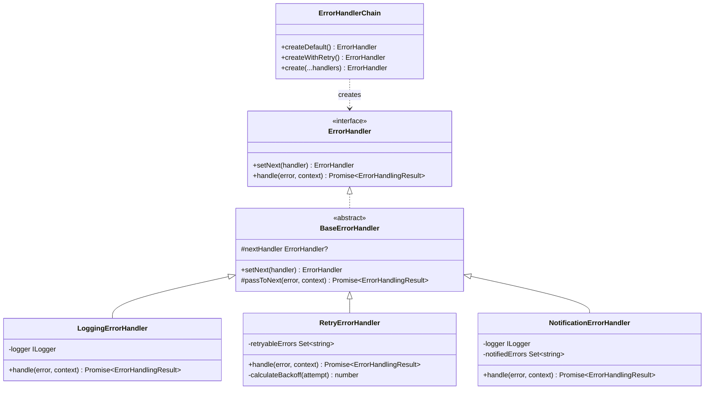

# Error Handling Chain (Chain of Responsibility Pattern)

## 📖 Visão Geral

Sistema centralizado de tratamento de erros usando o padrão **Chain of Responsibility**. Elimina duplicação de try-catch blocks e padroniza logging, retry, e notificações em toda a aplicação.

**Status:** ✅ Infraestrutura completa (94.93% coverage) | 🚧 Integração em progresso

---

## 🎯 Objetivos

- ✅ Eliminar ~100 linhas de código duplicado
- ✅ Centralizar lógica de retry com exponential backoff
- ✅ Padronizar estrutura de logs de erro
- ✅ Deduplicar notificações de erros críticos
- ✅ Facilitar testes com mock handlers

---

## 🏗️ Arquitetura

### Estrutura de Arquivos

```
src/utils/error-handling/
├── README.md                       # Este arquivo
├── index.ts                        # Exports públicos
├── error-context.ts                # Interface ErrorContext
├── error-result.ts                 # Type ErrorHandlingResult
├── error-handler.interface.ts      # ErrorHandler interface + BaseErrorHandler
├── error-handler-chain.ts          # ErrorHandlerChain builder
├── handlers/
│   ├── logging-handler.ts          # LoggingErrorHandler (structured logs)
│   ├── retry-handler.ts            # RetryErrorHandler (exp. backoff + jitter)
│   └── notification-handler.ts     # NotificationErrorHandler (deduplication)
└── __tests__/
    └── error-handling.test.ts      # 30 testes, 94.93% coverage
```

### Diagrama de Classes



---

## 🔌 API Pública

### 1. ErrorContext (Contexto da Operação)

```typescript
interface ErrorContext {
  service: string;           // "HttpService", "CaptureService", etc.
  operation: string;         // "GET /api/users", "Capture variable", etc.
  attemptCount?: number;     // Tentativa atual (1, 2, 3...)
  maxRetries?: number;       // Máximo de retries permitidos
  severity?: 'low' | 'medium' | 'high' | 'critical';
  metadata?: Record<string, any>;
}
```

### 2. ErrorHandlingResult (Resultado da Operação)

```typescript
type ErrorAction = 'retry' | 'skip' | 'rethrow' | 'abort';

interface ErrorHandlingResult {
  action: ErrorAction;
  message?: string;
  delay?: number;         // Milliseconds para wait antes de retry
  metadata?: Record<string, any>;
}
```

### 3. ErrorHandler Interface

```typescript
interface ErrorHandler {
  setNext(handler: ErrorHandler): ErrorHandler;
  handle(error: Error, context: ErrorContext): Promise<ErrorHandlingResult>;
}
```

### 4. ErrorHandlerChain (Builder)

```typescript
class ErrorHandlerChain {
  // Factory Methods
  static createDefault(): ErrorHandler;         // Log → Retry → Notify
  static createWithRetry(): ErrorHandler;       // Log → Retry
  static create(...handlers): ErrorHandler;     // Custom chain
}
```

---

## 🚀 Uso

### Exemplo Básico

```typescript
import { ErrorHandlerChain, ErrorContext } from '@/utils/error-handling';

class MyService {
  private errorHandler = ErrorHandlerChain.createWithRetry();

  async executeOperation(): Promise<void> {
    const maxRetries = 3;
    let attemptCount = 0;

    while (attemptCount < maxRetries) {
      attemptCount++;

      try {
        // Sua operação aqui
        await this.riskyOperation();
        return; // Sucesso!

      } catch (error) {
        const context: ErrorContext = {
          service: 'MyService',
          operation: 'riskyOperation',
          attemptCount,
          maxRetries,
          severity: 'high'
        };

        const result = await this.errorHandler.handle(error as Error, context);

        if (result.action === 'retry' && result.delay) {
          await this.delay(result.delay);
          continue;
        }

        // Se não deve retry, lança erro
        throw error;
      }
    }
  }

  private delay(ms: number): Promise<void> {
    return new Promise(resolve => setTimeout(resolve, ms));
  }
}
```

### Factory Methods

```typescript
// Cadeia padrão: Log → Retry → Notify
const handler1 = ErrorHandlerChain.createDefault();

// Apenas log e retry (sem notificações)
const handler2 = ErrorHandlerChain.createWithRetry();

// Custom chain
const handler3 = ErrorHandlerChain.create(
  new LoggingErrorHandler(),
  new RetryErrorHandler(),
  new CustomHandler()
);
```

### Builder API (Avançado)

```typescript
const handler = new ErrorHandlerChainBuilder()
  .addLogging()
  .addRetry()
  .addNotification()
  .build();
```

---

## 🔧 Handlers Disponíveis

### 1. LoggingErrorHandler

**Propósito:** Loga erros com contexto estruturado

**Comportamento:**
- Mapeia `severity` para níveis de log (error, warn, info, debug)
- Loga mensagem, stack trace, e contexto completo
- **Sempre** passa para próximo handler (não bloqueia chain)

**Logs gerados:**
```
[ERROR] HttpService - GET /api/users failed (attempt 1/3)
  Message: Network timeout
  Stack: Error: Network timeout...
  Context: {"attemptCount":1,"maxRetries":3,"severity":"high"}
```

### 2. RetryErrorHandler

**Propósito:** Decide se erro é retryable e calcula delay

**Erros retryable:**
- `ECONNRESET` - Connection reset by peer
- `ETIMEDOUT` - Operation timed out
- `ENOTFOUND` - DNS lookup failed
- `ECONNREFUSED` - Connection refused
- `NetworkError` - Generic network error

**Exponential Backoff:**
```
Attempt 1: 1000ms  (± 20% jitter)
Attempt 2: 2000ms  (± 20% jitter)
Attempt 3: 4000ms  (± 20% jitter)
Attempt 4: 8000ms  (± 20% jitter)
Attempt 5: 10000ms (cap máximo)
```

**Retorna:**
- `action: 'retry'` + `delay` se erro é retryable e não atingiu max
- `action: 'rethrow'` caso contrário

### 3. NotificationErrorHandler

**Propósito:** Envia notificações para erros críticos/high sem spam

**Deduplicação:**
- Cache de erros notificados por 5 minutos
- Chave: `${service}:${operation}:${errorName}`
- Previne spam de mesma notificação

**Severidades notificadas:**
- `critical` - Sempre notifica (ex: DB connection lost)
- `high` - Notifica (ex: API externa down)
- `medium` / `low` - Não notifica (apenas loga)

---

## ⚠️ Status de Integração

### ✅ Completo

- Infraestrutura base (interfaces, types)
- Handlers concretos (Logging, Retry, Notification)
- Builder e factory methods
- Test suite (30 testes, 94.93% coverage)

### 🚧 Em Progresso

**Bloqueio:** Circular dependency ao integrar com DI container

**Problema:**
```
LoggingErrorHandler → container.get<ILogger>(TYPES.ILogger)
                  ↓
              container.ts → VariableService → FakerService
                  ↓
              utils/index.ts → error-handler.ts → getLogger()
                  ↓
              (circular!) → Test mock não inicializa
```

**Solução Proposta:**
Refatorar handlers para receber logger via construtor (Dependency Injection explícita):

```typescript
// Antes
export class LoggingErrorHandler extends BaseErrorHandler {
  private logger = container.get<ILogger>(TYPES.ILogger); // ❌ Circular
}

// Depois
export class LoggingErrorHandler extends BaseErrorHandler {
  constructor(private logger: ILogger) {
    super();
  }
}

// Uso
const logger = container.get<ILogger>(TYPES.ILogger);
const handler = ErrorHandlerChain.createWithRetry(logger);
```

**Documentação completa:** [`docs/error-handling-di-integration-analysis.md`](../../../docs/error-handling-di-integration-analysis.md)

---

## 📊 Métricas

### Baseline (Antes)
- Duplicação de código: **8%**
- Try-catch blocks: **~100 ocorrências**
- Coverage geral: **78%**
- ExecutionService: **1971 linhas**

### Target (Após Task 01)
- Duplicação de código: **≤ 3%** (-62%)
- Try-catch blocks: **~20 ocorrências** (-80%)
- Coverage: **≥ 85%** (+7%)
- Linhas removidas: **~100 linhas**

### Atual (Phase 1)
- Coverage error-handling: **94.93%** ✅
- Testes: **30 passando** ✅
- Handlers implementados: **3/3** ✅
- Services migrados: **0/5** 🚧

---

## 🧪 Testes

### Rodar Testes

```bash
# Apenas error-handling
npm test -- src/utils/error-handling

# Com coverage
npm test -- --coverage src/utils/error-handling

# Watch mode
npm test -- --watch src/utils/error-handling
```

### Cobertura

```
File                          | % Stmts | % Branch | % Funcs | % Lines
------------------------------|---------|----------|---------|--------
error-context.ts              | 100     | 100      | 100     | 100
error-result.ts               | 100     | 100      | 100     | 100
error-handler.interface.ts    | 95.65   | 90.91    | 100     | 95.45
logging-handler.ts            | 92.85   | 75       | 100     | 92.85
retry-handler.ts              | 96.29   | 88.88    | 100     | 96.15
notification-handler.ts       | 95.83   | 77.77    | 100     | 95.65
error-handler-chain.ts        | 100     | 100      | 100     | 100
------------------------------|---------|----------|---------|--------
All files                     | 94.93   | 83.92    | 100     | 94.85
```

### Casos de Teste Cobertos

1. **Chaining** (5 testes)
   - Ordem de execução
   - Passagem entre handlers
   - Handlers sem next

2. **LoggingErrorHandler** (4 testes)
   - Diferentes severidades
   - Contexto estruturado
   - Sempre passa para next

3. **RetryErrorHandler** (8 testes)
   - Erros retryable vs não-retryable
   - Cálculo de backoff
   - Jitter (±20%)
   - Max retries
   - Cap de 10s

4. **NotificationErrorHandler** (5 testes)
   - Severidades critical/high
   - Deduplicação
   - TTL de 5 minutos

5. **ErrorHandlerChain** (4 testes)
   - Factory methods
   - Builder API
   - Custom chains

6. **Integração** (4 testes)
   - Cenários end-to-end
   - Retry + logging
   - Notification + logging

---

## 🔍 Troubleshooting

### Erro: "Cannot access 'mockLogger' before initialization"

**Causa:** Circular dependency durante import de módulos em testes

**Solução temporária:** Refatoração pendente (ver seção Status de Integração)

### Erro: "Handler não está executando"

**Causa:** Esqueceu de chamar `setNext()` ou ordem errada

**Solução:**
```typescript
// ❌ Errado
const handler1 = new LoggingErrorHandler();
const handler2 = new RetryErrorHandler();

// ✅ Correto
const handler1 = new LoggingErrorHandler();
const handler2 = new RetryErrorHandler();
handler1.setNext(handler2);
```

### Testes falhando aleatoriamente

**Causa:** Jitter no retry delay

**Solução:** Mockar `Math.random()` nos testes:
```typescript
jest.spyOn(Math, 'random').mockReturnValue(0.5);
```

---

## 📚 Referências

### Design Patterns
- [Chain of Responsibility - Refactoring Guru](https://refactoring.guru/design-patterns/chain-of-responsibility)
- [Gang of Four - Design Patterns](https://en.wikipedia.org/wiki/Design_Patterns)

### Retry Strategies
- [Exponential Backoff - AWS](https://aws.amazon.com/blogs/architecture/exponential-backoff-and-jitter/)
- [Circuit Breaker Pattern - Martin Fowler](https://martinfowler.com/bliki/CircuitBreaker.html)

### Documentação do Projeto
- [`tasks/architecture-improvements/01-error-handling-chain.md`](../../../tasks/architecture-improvements/01-error-handling-chain.md)
- [`docs/error-handling-di-integration-analysis.md`](../../../docs/error-handling-di-integration-analysis.md)

---

**Versão:** 1.0.0
**Última Atualização:** 2025-01-27
**Autor:** Architecture Team
**Status:** ✅ Phase 1 Complete | 🚧 Phase 2 Blocked (DI integration)
